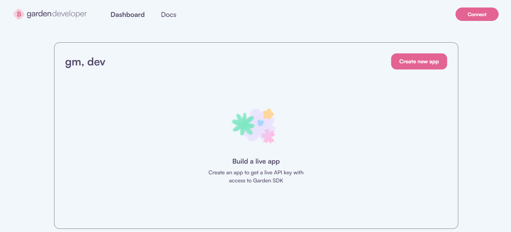
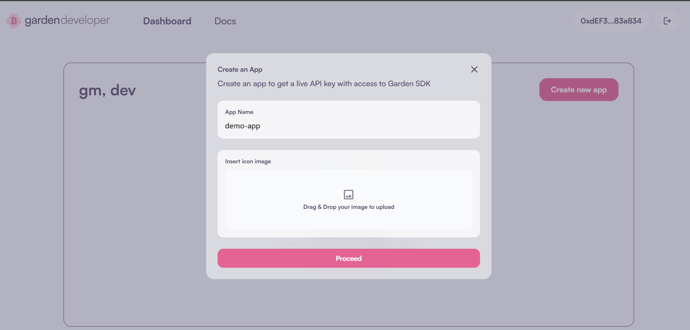
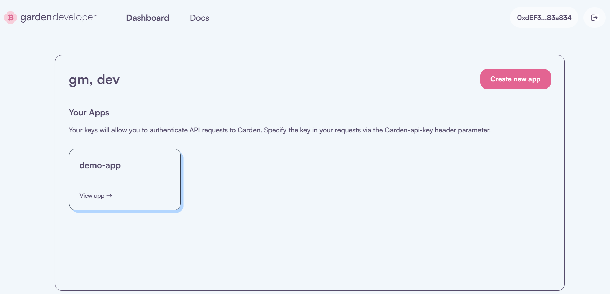
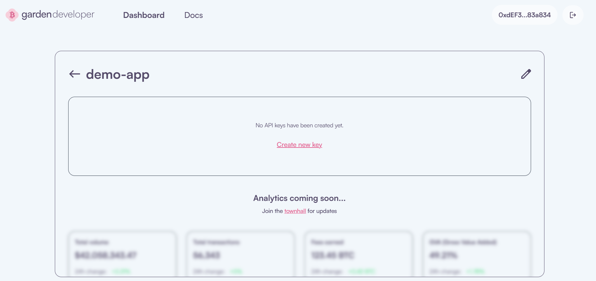
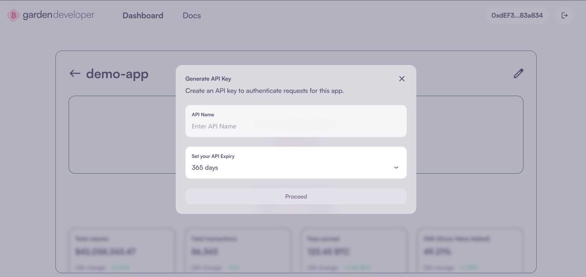
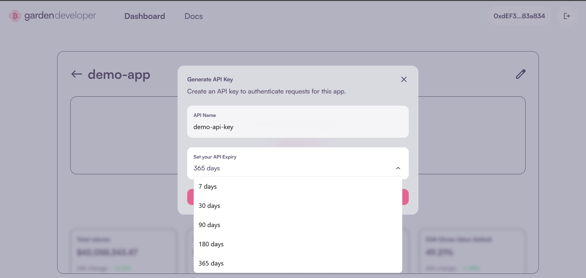
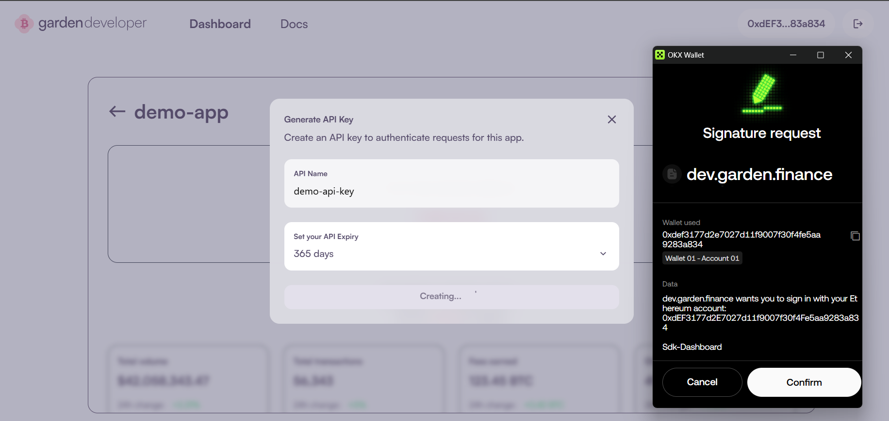
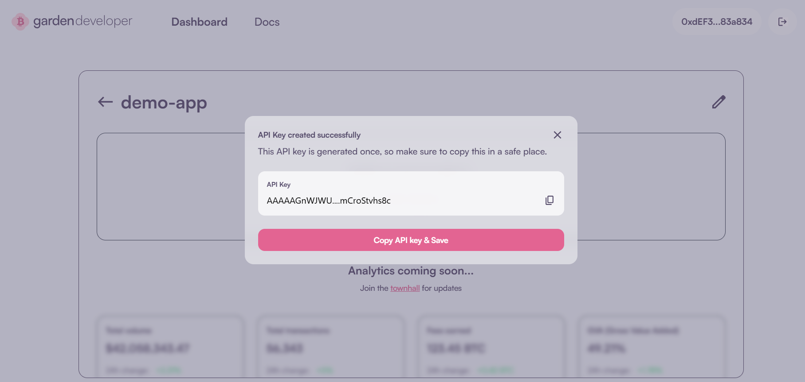
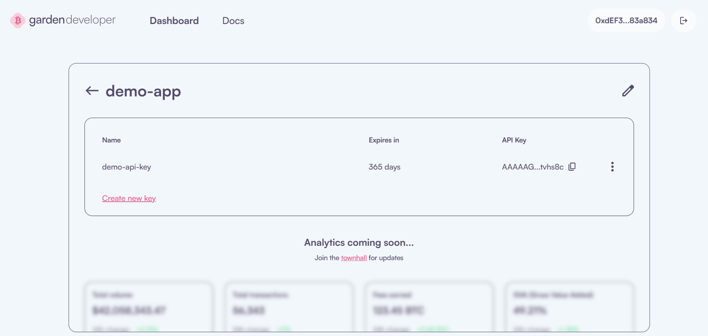

# API Key

You can use API key as an alternative to the Sign-In with Ethereum ([SIWE](https://eips.ethereum.org/EIPS/eip-4361)) protocol for authentication when integrating Garden. If the API key is passed during Garden initialization, the SIWE flow is skipped, and the key is used directly for authentication. 

API keys can be generated from the [Dev Dashboard](https://dev.garden.finance/). You can register your app and create a key with a custom expiration period. Once generated, this key can be used during integration without requiring the user to sign a message or go through the SIWE flow. If a valid API key is present, it will be used for all further authenticated steps in the Garden flow.

## Generating an API Key from the Dev Dashboard

- Go to [Dev Dashboard](https://dev.garden.finance/) and click on `Connect` to link your wallet.

- Click on `Create new app` button to open modal. Enter your app name (here "demo app") to register it.

- Once app is created, you’ll be able to see all your registered apps on the dashboard.

- Click on your newly created app to open its dashboard.

- Click the “Create New Key” button. A modal will open to configure the API key.

- Provide a name for the API key and choose its validity period from the dropdown.

- Click on `Proceed` to trigger a signature pop-up. Confirm the signature to continue.

- The API key will be generated successfully. Click on `Copy API key & Save` to save it securely.

- The generated API key will now be visible on your app's dashboard.

